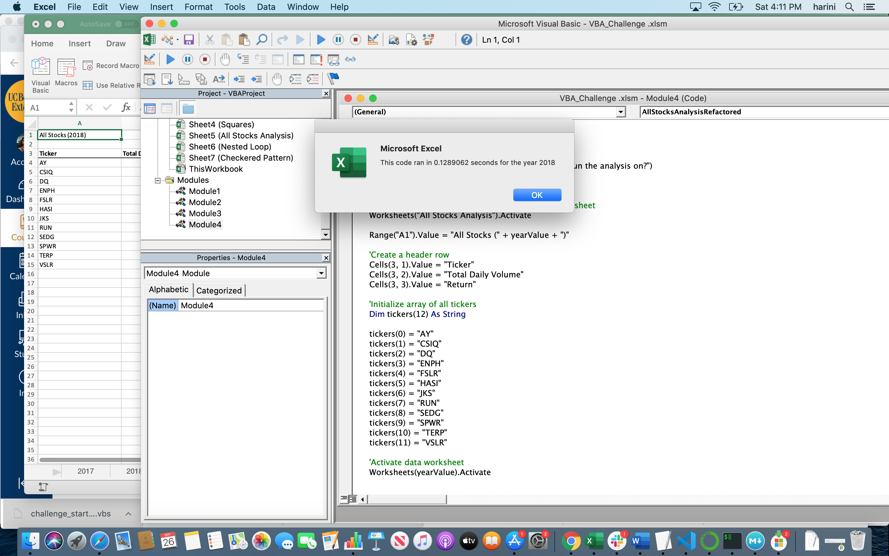

# Module 2 Challenge 

## Overview of the project

The main purpose of the analysis is to refactor existing code to make it more efficient and faster to analyse large amounts of stock data over the years with a click of a button so that Steve can provide his parents with a more detailed analysis.

## Results

Stock Performance of 2017 has profitable returns for most of the stocks except for "TERP". Highest return of 199.4% is made on "DQ" stock.
 
In year 2018, the profitable returns are seen only for "ENPH" and "RUN" and rest of all other stocks have negative returns. 

Comparing the years 2017 & 2018 seems to conclude that both "ENPH" and "RUN" had profitable returns continuously for two years but "RUN" had seen a huge bump of 78.5% return in 2018 where as "ENPH" has reduced return of 47.6% compared to previous year.

As you can see in the screenshot below,

With the refactored code, code run time for 2017 stock analysis is faster by approximately 0.35sec when compared to 2017 original script(run time was ~0.5sec)

Similarly, 2018 stock analysis run time is also faster by approximately 0.38sec compared to 2018 original script(run time was ~0.5sec)

## Summary

### Advantages of refactoring code

* Refactoring the code can make the code faster and efficient
* Makes the code to look much neater, uses less memory and also makes it easier for other users to read and expand further

### Disadvantages of refactoring code

* Can introduce bugs
* Sometimes it might be difficult to refactor (especially if it's someone else's code)if the code is complex. Cost of refactoring can be more expensive than writing the code from scratch.

### Advantages and Disadvantages of the original and refactored VBA script

I noticed from the run times, refacored VBA script is much faster than original VBA script but it is time consuming. 